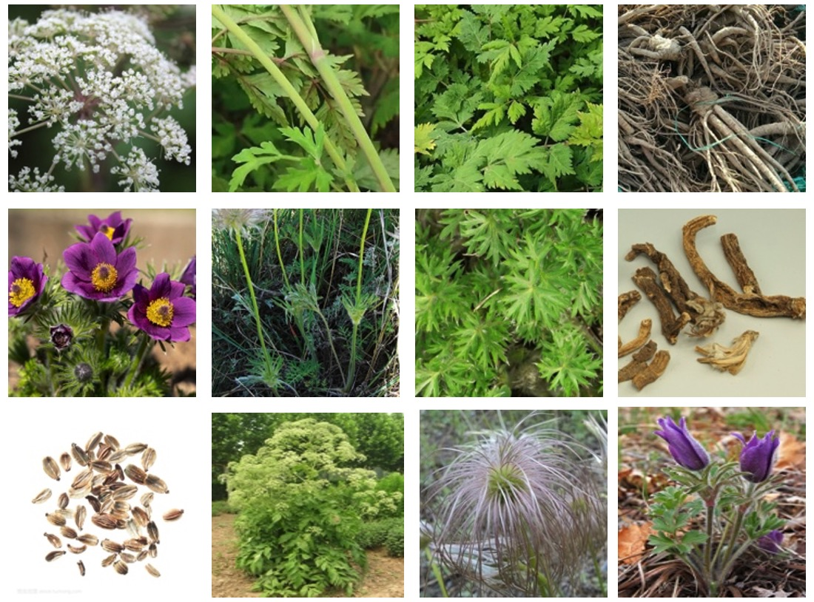
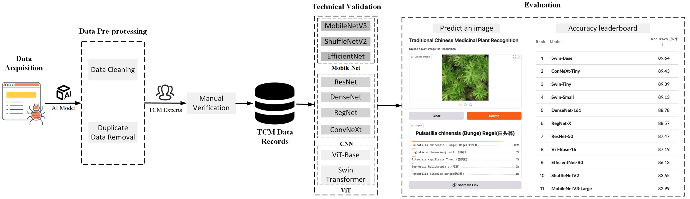
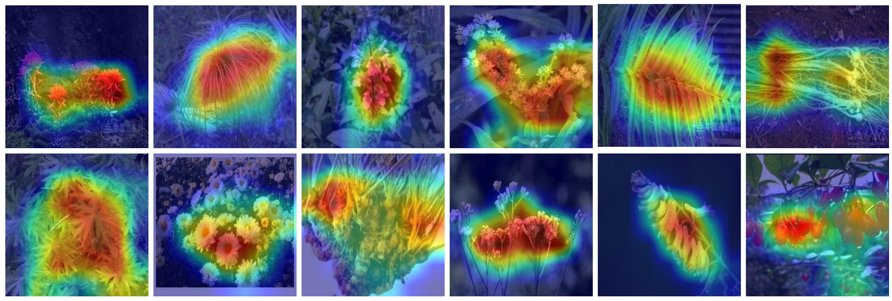
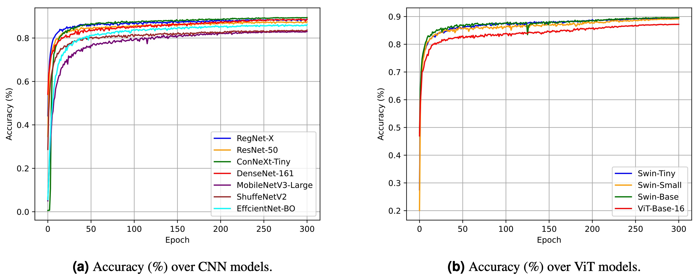
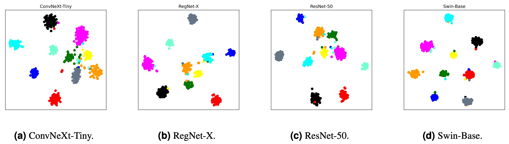
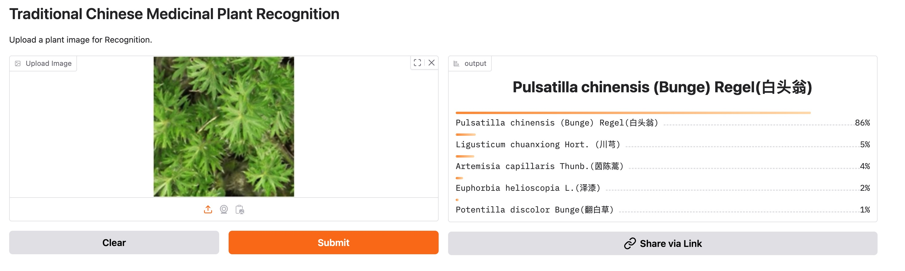
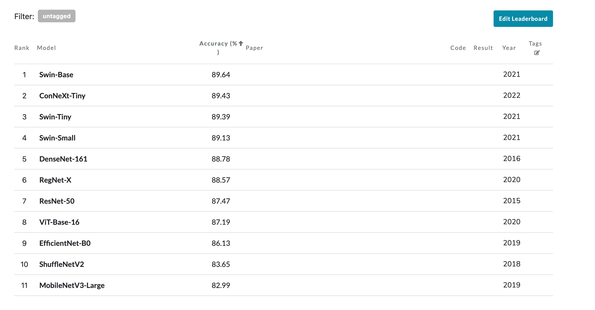

#  TCMP-300: A Comprehensive Traditional Chinese Medicinal Plant Dataset for Plant Recognition

Traditional Chinese medicinal plants are often used to prevent and treat diseases for the human body. Since various medicinal plants have different therapeutic effects, plant recognition becomes an important topic. Traditional identification of medicinal plants mainly relies on human experts, which does not meet the increased requirements in clinical practice. Artificial Intelligence (AI) research for plant recognition faces challenges due to the lack of a comprehensive medicinal plant dataset. Therefore, we present a Chinese medicinal plant dataset that including 52089 images in 300 categories. Compared to the existing medicinal plant datasets, our dataset has more categories and fine-grained plant parts to facilitate comprehensive plant recognition. The plant images were collected through the Bing search engine and cleaned by a pretrained vision foundation model with human verification. We conduct technical validation by training several state-of-the-art image classification models with advanced data augmentation on the dataset, and achieve 89.64\% accuracy. Our dataset promotes the development and validation of advanced AI models for robust and accurate plant recognition.



Overview of the data processing workflow and evaluation for our TCMP-300 dataset:


## Environment

Ubuntu 20.04 LTS

Python 3.9

CUDA 11.8

please install python packages:
```
pip install -r requirements.txt
```

## Data Cleaning
We adopt pretrained visual foundation model CLIP for data cleaning. We conduct text-to-image and image-to-image mode to search dirty samples.

The script of text-to-image mode is:
```
python data_cleaning.py \
    --image2image "False" \
    --search_text $Text description for text-to-image search$ \
    --source_folder $your data path$ \
    --target_folder $your data path$
```

The script of image-to-image mode is:
```
python data_cleaning.py \
    --image2image "True" \
    --base_image_path $your reference image path$ \
    --source_folder $your data path$\
    --target_folder $your data path$
```


## Training

### Baseline training with basic data augment 
```
python train.py \
    --arch $model type like resnet50$ \
    --batch-size 64 \
    --init-lr 0.01 \
    --epochs 300 \
    --traindir  $you data path$ \
    --valdir  $you data path$ \
    --gpu-id 0 \
    --manual_seed 0 \
    --imagenet-pretrained  $pretrained model ckpt path$ \
    --checkpoint-dir $output dir$
```

### Training with data augmentation HybridMix
```
python train.py \
    --arch $model type like resnet50$ \
    --batch-size 64 \
    --init-lr 0.01 \
    --epochs 300 \
    --traindir  $you data path$ \
    --valdir  $you data path$ \
    --gpu-id 0 \
    --manual_seed 0 \
    --imagenet-pretrained  $pretrained model ckpt path$ \
    --checkpoint-dir $output dir$ \
    --hybridmix
```
Accuracy of models:
| Models | Baseline | HybridMix |
| :--: | :--: | :--: |
| MobileNetV3-Large  | 81.76 | 82.99 |
|  ShuffleNetV2 | 82.13 | 83.65 |
|  EfficientNet-B0 | 84.62 | 86.13 |
| ResNet-50  | 86.51 | 87.47 |
|  DenseNet-161 | 87.76 | 88.78 |
|  ConNeXt-Tiny | 88.18 | 89.43 |
| RegNet-X  | 87.75 | 88.57 |
|  Swin-Tiny | 88.27 | 89.39 |
|  Swin-Small | 86.96 | 89.13 |
| Swin-Base  | 87.88 | 89.64 |
| ViT-Base-16  | 83.25 | 87.19 |

## Inference
The pretrained model can infer the given image to predict the category:
```
python inference.py  --image-path [your image path]
```

## Visualization

### Visualize attention heatmaps
Given an image, you can visualize the attention heatmaps to show the regions that the AI model attends to.
```
python test_grad_cam.py \
    --image-path [your image path] \
    --output-dir [your output directory path]
```
Outputs:


### Plot the training curve

```
python draw4total_acc.py
```

This will plot all model training curves according to the log files under certain dir, you can manually set it within the script.

Outputs:



### Visualize the feature space by tsne 

We also provide the tsne visualization.

First, you need get some embeddings npy file by 

```
python t_sne.py \
    --arch $model type like resnet50$ \
    --batch-size 1 \
    --init-lr 0.01 \
    --epochs 300 \
    --traindir  $you data path$ \
    --valdir  $you data path$ \
    --gpu-id 0 \
    --manual_seed 10 \
    --imagenet-pretrained  $your model ckpt path$ \
```

This will automatically save the required npy files under dir *npy/*

Then you can visualize it by

```
python t_sne_visual.py
```
Also, you can modify the model type within the script.

Outputs:



## Web demo
We deploy the pretrained plant recognition model into a web demo over huggingface. You can visit https://winycg-tcmprecognition.hf.space/?__theme=system&deep_link=trNDfB9dwx8 and upload a plant image for recognition.



## Leaderboard
We open a leaderboard on paperwithcode ([https://paperswithcode.com/sota/image-classification-on-tcmp-300](https://paperswithcode.com/sota/image-classification-on-tcmp-300)). You can upload your better accuracy on the TCMP-300 dataset.



